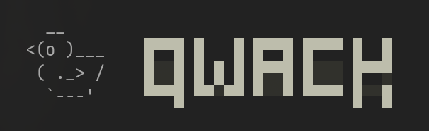

<p align="center">
  
  <br>
  <strong>Collaborative AI coding. Steer AI agents together.</strong>
</p>

<p align="center">
  <a href="https://github.com/qwack-ai/qwack/actions"></a>
  
  
</p>

<p align="center">
  <a href="https://docs.qwack.ai">Docs</a> · <a href="https://qwack.ai">Website</a> · <a href="#install">Install</a>
</p>

<p align="center">
  <video src="https://github.com/user-attachments/assets/e532958a-8782-4925-967c-ac27c97fe77d" width="800"></video>
</p>

---

Multiple developers steer a single AI agent in real time — same context, same conversation, same codebase. Built on [OpenCode](https://github.com/anomalyco/opencode). 🦆

- **One agent, shared context** — everyone sees the same streaming output, tool calls, and reasoning
- **Credentials stay local** — API keys, env vars, and secrets never leave the host's machine. Tool output is relayed so collaborators can see what the agent does.
- **Terminal-native** — full OpenCode experience with collaboration layered on top

## Install

```bash
# macOS / Linux
curl -fsSL https://qwack.ai/install | sh

# Windows
irm https://qwack.ai/install.ps1 | iex
```

Or download binaries directly from [GitHub Releases](https://github.com/qwack-ai/qwack/releases).

## Quick Start

```bash
qwack                          # launch
/qwack login                   # authenticate with GitHub
/qwack start                   # create a session
# share the code → teammate runs: /qwack join SWIFT-DUCK-42
```

## How It Works

The host runs the AI agent locally. Collaborators send prompts through a lightweight relay. The server never sees your source code, API keys, or credentials — only conversation content (protected by TLS).

```
Host                              Collaborator
┌──────────────┐                  ┌──────────────┐
│ Your code    │                  │ Their code   │
│ Your API key │                  │ (read-only)  │
│ Agent runs   │                  │ Qwack TUI    │
│ here         │                  │ (relay mode) │
└──────┬───────┘                  └──────┬───────┘
       └────────► Qwack Server ◄─────────┘
                  (TLS relay)
```

## Commands

| Command              | Description              |
| -------------------- | ------------------------ |
| `/qwack login`       | Authenticate with GitHub |
| `/qwack start`       | Create a session         |
| `/qwack join <code>` | Join by short code       |
| `/qwack invite`      | Show join code           |
| `/qwack who`         | List participants        |
| `/qwack msg <text>`  | Chat message             |
| `/qwack host <user>` | Transfer host role       |
| `/qwack kick <user>` | Remove participant       |
| `/qwack leave`       | Leave session            |
| `/qwack status`      | Connection info          |

## License

- **TUI, Plugin, SDK** — [MIT](LICENSE)
- **Server** — [AGPL-3.0](packages/qwack-server/LICENSE)

---

<p align="center">
  Built with ❤️ by <a href="https://github.com/qwack-ai">Qwack AI</a>
</p>
